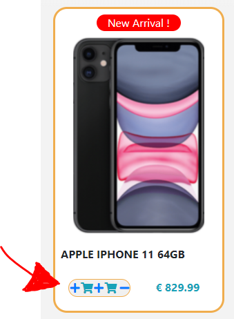

# Mobile Central

An online shop's portal specilaized in mobile phones.  
The main typologies of the products on sale are Smartphones and old-fashioned flip phones/lcd display phones, collectively grouped under the nostalgic header "GSM".
Users can avail of navigation menu links to browse the site, search products, look up individual product descriptions, post comments, read and (as registered users) write products reviews, contact the store owner via the contact form.
The Website offers users the option of becoming registred users and thus being able of persisting their carts between visits, post reviews, and view/print their orders history.
It is not necessary to be a registred user to place an order.

The goals of the website are:
* to maximise sales with its presence on the internet; 
* showcasing products and thus raising public awareness of the Business;
* affiliate customers with the conveniences that come with a registered account. 

The goals of the website users are:
* quickly obtain visual clues and information on mobile phones on offer, such as product description and reviews left by other website users;
* easily complete purchase of products of interest.

---

## UX

There types of clientele sought are two : 

* enthusiast mobiles users who are always up to date with latest technologies and fashonable items on the market, these are prepared to spend a substantial amount of money for a well rounded product.
* common mobiles users who see the product more as a neccessity than a fancy thing to have; they will settle for a product that meet their minimal expectations with the least inpact on their finances. 

The website addresses the needs of both with a division in two main categories amd with a clear display of products from each in the landing page. Product descriptions and reviews are available to allow customers to make an informed decision. 
Customers can make specific queries via contact form.

### User Stories

As a .. | I want to .. | So I can ..
 --- | --- | --- 
New customer | Immediately learn the nature of the business | Determine quickly if the product I seek can be found in the store
Potential customer | easily navigate through the site | Find quickly the desired product/related information
Commited customer | easily and clearly be guided through the payment process | Finalize the transaction and secure the desired product
Potential customer | Avail of enough, to-the-point information on the merchandise | Make an informed decision on whether or not I should purchase a product
New/Returning Customer | Send specific queries to the store owner | Obtain more information than what found on the website/Leave feedback on my experience with the site
Registred User | Access my order history | Keep track of my expenses or resolve disputes
Registred User | Have my cart persited between visits | Do without having to restart the entire process when I make a resolute decision to buy
Store clerck | Access the store database | update prices and stock quantities, thus mainataining the information on the website up to date

### Wireframes

* [Landing page](https://mmmp4.s3-eu-west-1.amazonaws.com/mmmp4Wireframes/MM+Landing+page+wireframe.png)
* [Categories](https://mmmp4.s3-eu-west-1.amazonaws.com/mmmp4Wireframes/MM+Categories+page.png)
* [Contact page](https://mmmp4.s3-eu-west-1.amazonaws.com/mmmp4Wireframes/MM+Contact+page+wireframe.png)
* [Contact page signed in](https://mmmp4.s3-eu-west-1.amazonaws.com/mmmp4Wireframes/MM+Contact+page+Signed+In+wireframe.png)
* [Product page](https://mmmp4.s3-eu-west-1.amazonaws.com/mmmp4Wireframes/MM+product+page+wireframe.png)
* [Sign in page](https://mmmp4.s3-eu-west-1.amazonaws.com/mmmp4Wireframes/MM+Sign+In+page+wireframe.png)
* [Sign up form](https://mmmp4.s3-eu-west-1.amazonaws.com/mmmp4Wireframes/MM+Sign+Up+page+wireframe.png)
* [Cart page](https://mmmp4.s3-eu-west-1.amazonaws.com/mmmp4Wireframes/MM+cart+page+wireframe.png)
* [Thank You page](https://mmmp4.s3-eu-west-1.amazonaws.com/mmmp4Wireframes/MM+thank+you+page+wireframe.png)
* [Orders List](https://mmmp4.s3-eu-west-1.amazonaws.com/mmmp4Wireframes/MM+Ordres+List+wireframe.png)
* [Add product](https://mmmp4.s3-eu-west-1.amazonaws.com/mmmp4Wireframes/MM+Add+Product+page+wireframe.png)
* [Product update successful](https://mmmp4.s3-eu-west-1.amazonaws.com/mmmp4Wireframes/MM+Operation+succesfull+page+wireframe.png)

---

## Features

* The navigation bar, present at the top of all pages, includes: 
* * A Logo, in the shape of a Smartphone, is situated at the top left of the screen, the first item on the Navbar from the left. shows on all pages. On click, it redirects to a display of all the products on sale.
* * The Business' name "Mobile Central" second from the left on large screens, dead in the middle on small screens. On click, it brings back to the landing page, as a "Home" button would.
* * A collapsible dropdown menu containing links to  other sections of the website, submenus, and a search box. On small screens it shows collapsed as an hamburger button, while on large screens the first level items of the dropdown menu are displayed horizontally along the navbar.
* The Landing or "Home" page. 
* * It displays all products that have been marked by the store with the caption "New Arrival!". On this page, however, the caption does not appear on each product, to avoid a redundant and unsightly repetition.
* * The user is rather informed that these are the latest arrivals by a red header above the products' grid; it reads "Check Out the Latest Arrivals!". 
* * A hero image stands between the navbar and the page header. It contains a slide show of all the latest products. The slide show can be halted by hovering the mouse on it. Clicking on a product's slide will lead to that products's page. The hero slideshow fades away as the user scrolls down the page, and fades back in as the user scrolls back to the top. 
* * Two intuitive buttons just under the header are used to sort by highest or lowest price and by alphabetical or reversed alphabetical order. Once sorted, the sorting status is announced within the header. 
* * The products grid, containing all the products in row and column display. The grid is screen-width responsive. Each product's image is framed in a yellow bordered, rounded edge box with on a white background, with the products name, price and a "+" link at the bottom of the box. The "+" acts like an "Add to cart" button.
* * A "Back to the Top" button shows fixed at the bottom right corner. This only shows on pages higher than 1.5 times the viewport. On click, it scroll the page back to the top in a smooth manner.
* The Show_all_products page.
* * Accessed by clicking on the mobile icon (top left of the navbar), is similar to the landing page, except it diplays all the products on sale.
* * Accordingly, the hero image contains a slide show of all products, and the header reads "Showing all products".
* * All other features identical to the ones on the Landing page.
* The Categories, Brands and Search return pages, have identical structures and features to the landing pages, except:
* * There is no hero slideshow. 
* * The products returned are filtered by product type or brand (by clicking on the appropriate link on the navbar submenus), or are the result of the navbar's search box query.
* * Accordingly, the header reads the products' on display type or brand, or the search terms.
* The individual product page.
* * Accessed by clicking on the product's image from the products grid on each of the above pages.
* * Contains a page with the products image, description, price, relevant reviews, and:
* * an "Add to cart" link that, on click, simultaneously adds the product to and opens up the cart page.
* The cart page.
* * Accessed by the "Add to cart" link on the product page or by clicking on the cart icon on the navbar, which appears after a product is placed in the cart.
* * Composed of two main section,
* * * the first is a series of rows for each product in the cart, with their image, name, SKU, price, quantity in the cart, and cost subtotal, and the " + ", " - ", and trash icons. These icons' functions are to increase, decrease, or remove althogheter the product from the cart.
* * * the second component is the check out panel, with a written request to the user to review his order, the order total, a trash icon with associated cart emptying function on click, a button to initiate the 3rd party Stripe payment function, and a button to return to the landing page.
* * Two main parts are side by side on large screen, check out to the left, stacked on smaller screen, check out at the bottom.
* * On click, the check out button brings up a small form from Stripe, where the user can enter his personal and shipping details, along with credit card detais. If the user is authenicated, his/her email will automatically fill the relevant field in the form. This is the key for future order details retrieval. By clicking "Pay" on the form, the transaction is processed, and the user is returned to the "thank You" page, where his order number and details are displayed. Upon loading of this page, an email is fired to the user's address, containing the order's details.
* The Contact form. A form accessed by the navbar that allows the user to send messages to the store owner.
* * If the form is accessed by a registered user, his/her name and email fields do not required.
* * Upon submission, the page refreshes to confirm receipt of the message and to display the message content. An email is fired at the user's provided or registered address at this point, again confirming successful subsmission.
* The Sign In form. 
* * A form accessed by the navbar that allows registered users to login into their account. 
* * Upon logging in, the "Sign Up" link is hidden and replaced with a word of welcome to the user, which includes a dropdown link to the user's order history. Also upon logging in, the "Sign In" link on the navbar is replaced with the "Sign Out" link.
* * The page is divided in two sections, which align horizontally on large screen and stack up on smaller screens. 
* * The first half contains an invitation to unregistred users to start the registration proceess by clicking on the button provided. The second half contains the user name and password form fields, along with the login button.
* The Registration form.
* * Accessed via the link on the Sign In page, it contains a form where the perspective user can enter his personal details and set a user name and password.
* * Upon submission via the button provided, the page refreshes to a registration confirmation statement and a link to the login page. An email is fired at the user's newly registered address at this point, again confirming successful subsmission.
* Order history.
* * Accessed by the dropdown menu link under the Welcome to the User words in the navbar, which shows only to logged in users.
* * The link opens up to a summary table of the past orders made by the user, showing the orders' ids, creation dates, amounts paid, orders' status, and links to the complete details of each order in form table.
* * On click, the link to each orders details opens up a page with the table containing all the orders details, including orcer number, items purchased and shipping details. This page features a print button.
* * The list does not collapse but can be scrolled horizontally on small screens.
* Product Management.
* * If the logged in user has staff status, a dropdown menu, "Product Management" will show in red on the navbar.
* * The dropdown menu consists of 5 pages, each containing a form to either create a product, update/delete a product, add a side picture (that is, any picture other than the main for the product), delete a side a picture, add a brand.
* * A valid form will return on submission, a page confirming to the user the success of the operation.

## Technologies used
* Django framework (python)
* Gitpod develpoment enviroment
* HTML5
* CSS3, Bootstrap 4
* Javascript, Jquery

## Cloning this project from Github to your Gitpod account.
This project's repository can be found [here](https://github.com/PaoloAlbanese/Mobile_Central_MP4)(not to be confused with the [test version](https://github.com/PaoloAlbanese/MS4-Project) of the website).
Please access the repository on a Chrome browsers complete with [gitpod extension](https://www.gitpod.io/docs/browser-extension/).
By clicking the green "Gitpod" button in the top right corner of the repository, you will to create a new workspace from the repository's code in your enviroment.

The live deployed webiste can be found on [Heroku](https://mm-mp4.herokuapp.com/).

## Testing
The testing was carried out extensively on another gitpod workspaces, the repository of which is also on [Github](https://github.com/PaoloAlbanese/MS4-Project) of the website).
This separate project is were I first implemented all the functions, run all the test as a website user, running the server after every modification.
This test project consist of one main app. When I decided to build the final version of the project I created a new workspace, where all the main parts are broken up in separate apps. 
I copied and trimmed of commented out code each the part of the unified test website on to the relevant app in final version workspace, running the server after each app was complete and reading any debug error that may arise.
In the initail prototype website build up, I used the website in any way a perspective customer, registered user or staff member would, taking note of what I would like to see changed and trying to implent it.
In the final version workspace I retested the webiste as before each time I added a new part from the prototype website.
Please note: on both the test and the final website there is a marquee within the navbar alerting visitors that the website is on TEST and purchases do not actually take place. This is 

### Main bugs found

Several pages display a products grid. Each product on the grid has a " + " icon that functions as an "add to cart" button. The purpose of it is to give the customer the convenience of adding a product to cart from the grid, without having to open the products page first. On click, the " + " invokes the same view that is triggered by the "Add to cart" link in the Products page.
The problem was that at each new click of " + ", the page was re-rendered and the another " + " and cart icon was appearing beside the first:

This was occurring because at each rendering of the page, for each product on the grid, the html was going through each item in the cart, and if found a match, it would check the product qauntity against the product's stock in order to decide whether to render a " - " or "ban" sign next to the cart icon, so that the user could remove it from the cart with a single click, or be aware that he could not buy more of it.
because this process was repeating for every product on the grid, adding a product to cart would make the page render again and go through the same for loop template literals tags, find the match again and add another plus sign. See code below:

<!--- 

                                    
                                        

                                            <a href="?source=ind" class=" my-auto mx-auto " onclick="SameScroll()"><i class="fas fa-plus" style=""></i></a>
                                            <i class="fas fa-shopping-cart my-auto " style=""></i>
                                        
                                        
                                            <i class="fas fa-ban my-auto my-auto mx-auto text-danger" style=""></i>
                                            <i class="fas fa-mobile my-auto mx-auto" style=""></i>
                                            
                                    
                                            
                                    

                                
                                    
                                        
                                        
                                            <i class="fas fa-ban text-warning my-auto my-auto mx-auto" ></i>
                                            <i class="fas fa-shopping-cart my-auto " style=""></i>
                                                                    

                                        
                                            <a href="?source=ind" class=" my-auto mx-auto text-warning" onclick="SameScroll()"><i class="fas fa-store" style=""></i></a>
                                            <i class="fas fa-shopping-cart my-auto " style=""></i>
                                                                    
                                                                  
                                 
'
--->
To identify at what point of the code this was happening I changed the fontawesome icons in each if statement, to have a visual undestanding of where did things go wrong:

Finally I added another for loop with a products in the cart worked out from views.py:
<!--- 
for i in Product.objects.all().iterator():
            

            prod_id = i.id
            if prod_id not in in_cart:
                not_in_cart.append(prod_id)'

this would make show the plus sign appear only once because it would not be caught in the and the previous if statements simultaneously.

'
                                    

                                        <a href="?source=ind" class=" my-auto mx-auto " ><i class="fas fa-plus" style=""></i></a>
                                        
                                        <i class="fas fa-shopping-cart my-auto " style=""></i>
                                        
                                    
                                '
--->

This bug is stil alive in the test version of the site in the "showAll" view.

Another bug was causing the page to scroll to the top when it was re-rendered. for example, clicking on the " + " on a product from at bottom of the grod would cause the rendering to load the page at the top scrolling position, while the user may well have wanted to keep looking at the products on the same scroll level or keep scrolling further down.
A Javascript text was implemeted to preserve the scroll position on reload and that worked fine, but it was also causing the scroll to be replicated on other pages as well. So if a user was to add to cart seveal products from the grid would and then from there move to the cart page, the cart page would load already well scrolled down, due to the lenght of the cart in item list.
So the script to preserve scroll needed to trigger only when the referer and loading page wher the same.
I found, modified and implemnted in views.py this useful snippet (Copyright (c) 2009 Arthur Furlan <arthur.furlan@gmail.com>), which determines if wahat was the referer url:

'def get_referer_view(request, default=None):
    ''' 
    Return the referer view of the current request

    Example:

        def some_view(request):
            ...
            referer_view = get_referer_view(request)
            return HttpResponseRedirect(referer_view, '/accounts/login/')
    '''

    # if the user typed the url directly in the browser's address bar
    referer = request.META.get('HTTP_REFERER')
    if not referer:
        return default

    # remove the protocol and split the url at the slashes
    referer = re.sub('^https?:\/\/', '', referer).split('/')
    # if referer[0] != request.META.get('SERVER_NAME'):
    #     return default

    # add the slash at the relative path's view and finished
    referer = u'/' + u'/'.join(referer[1:])
    return referer'

the result is compared to the current url sourced in the current view:

' this_url = request.path'

This values passed to and compared in the script, so it preserves the scroll only if they are identical. 

## Acknowledegements

* This project is heavily indebeted and influenced, in narly it's entirety to the illustrative project walkthrugh "Boutique Ado" on the Code Institute student portal and the Udemy course "[Build Ecommerce Website to Master Django and Python](https://www.udemy.com/course/build-ecommerce-website-to-master-django-and-python/)" by The Zero2Launch Team . The Zero2Launch Team develops high-quality programming courses around topics in mobile development including iOS, Android, Responsive Web Design and other emerging technologies.
* The slide shows are taken with modifications from [W3School] (https://www.w3schools.com/howto/howto_js_slideshow.asp).
* The color gradient change on hover in the hero slide show is taken with modifications from [Sarah L. Fossheim](https://fossheim.io/writing/posts/css-text-gradient/).
* The mobile pictures sources are :
* * [Carphone Warehouse](https://www.carphonewarehouse.ie/);
* * [Amazon](https://www.amazon.com/);
* * [Eir Mobile](https://www.eir.ie/mobile/);
* Several icons are sourced from Fontawsome;
* The default phone image is sourced from [Five Flowers](https://pixabay.com/?utm_source=link-attribution&amp;utm_medium=referral&amp;utm_campaign=image&amp;utm_content=2245651) on Pixabay.
* The script to fade the hero slideshow on scrool is taken from [Nick Ciliak](https://codepen.io/nickcil/pen/sfutl) on Codepen; all other scripts that involve fading on scroll are derived from this code. At least that's my recollection. If not I apologize to rightful author.
* The ringing phone gif in the page overaly is taken from [B2B Maintenenace house](https://b2b.maintenancehouse.com/assets/b2b/images/icons/mobile-ring.gif);
* [Stackoverflow](https://stackoverflow.com/) and [W3Schools](https://www.w3schools.com/) where widely used for general reference.

I unreservedly apologize if any code portion or picture is misattribuited or not attribuited to their authors. It is a genuine human error. I am still learning and this is the most intense project I've done so far, please try to understand.

## Notes to the project's assesors:

* I created a user with staff privileges:
* * username: testinauser
* * password: #V342516
You can login with this username and view the product management functionalities. You can use it also to reduce a product stock to a low number or to 0 and visulaize how it affects the products grid and cart functionalities.
* There is also another mock user, he is only a basic registered user:
* * username: Cicciuser
* * password: same as testinauser
* The emails are sent via emailJS
* * I am using two separate accounts with them, because you can have a maximum of two email teamplates on a free acoount, and I use three.
* * Each account is the on the free tier basis, meaning they can fire a maximum 200 emails per month. I'm already under the 190 emails for this month. Something to keep in mind if you test the functionality heavily and notice the emails are not coming through anymore.
* The Stripe modal may attempt to send a confirmation code to a mobile if it recognizes the email address. If you wait a few seconds it will let you entered the cutomer details and credit card manually. 
* The Stripe keys are the Test ones, be sure to use credit card number 4242 4242 4242 4242, expiry date in the future.
* Allauth was installed at the beginning of the project but then not used. I didn't uninstall it for fear of breaking something in the configurartion. 

